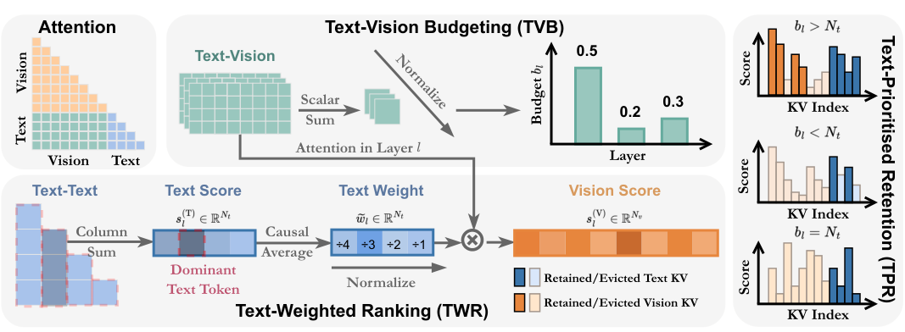
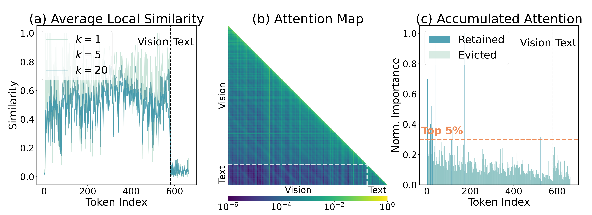
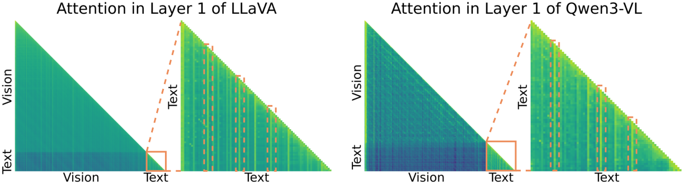

# TGV-KV: Text-Grounded KV Eviction for Vision-Language Models

<p align="center">
  
</p>


Official implementation of **TGV-KV**, accepted at **ICML 2026**.

## Overview

Vision-Language Models (VLMs) cache the keys and values (KV) of all previous tokens during auto-regressive generation, causing memory consumption that grows linearly with context length. This burden is especially severe in multimodal inference because visual inputs occupy abundant yet highly redundant tokens. Existing KV eviction methods, mostly designed for language models, overlook the **modality gap** between text and vision and suffer performance degradation when directly applied to VLMs.

<p align="center">
  
  <br>
  <em>Visualization and consequence of the modality gap: (a) cosine similarity reveals distinct vision/text clusters, (b) attention maps show limited cross-modal interaction, (c) accumulated attention leads to uneven eviction.</em>
</p>

**TGV-KV** is a **training-free** and **calibration-free** framework that leverages text to guide visual KV compression. It consists of three synergistic modules:

- **Text-Vision Budgeting (TVB):** Allocates layer-wise KV retention budgets based on the intensity of cross-modal attention — layers with stronger text-vision interaction receive more budget, without any calibration data.
- **Text-Weighted Ranking (TWR):** Ranks visual KV importance by grounding them in dominant text tokens via text-text attention weights, producing a more robust importance metric than unimodal attention alone.
- **Text-Prioritised Retention (TPR):** Preserves all text KV pairs first (since text is eviction-sensitive), and evicts visual KV pairs based on TWR scores. Text is only evicted under extreme budget constraints.

<p align="center">
  
  <br>
  <em>Attention maps of LLaVA-1.5-7B and Qwen3-VL-8B, showing "dominant text tokens" that concentrate cross-modal attention.</em>
</p>

## Installation

Follow these steps to set up the environment and necessary dependencies.

### 1. Setup Environment

Create and activate a new conda environment:

```bash
conda create -n tgv python=3.10 -y
conda activate tgv
```

### 2. Setup `lmms-eval`

Install the evaluation toolkit:

```bash
cd lmms-eval
pip install -e .
cd ..
```

### 3. Install Requirements

Install additional dependencies:

```bash
pip install -r requirements.txt
```

### 4. Patch Libraries (Important)

You must manually modify specific files in your installed python packages (`transformers` and `qwen_vl_utils`) to support the required functionality.

#### A. `transformers/masking_utils.py`

Locate the file `transformers/masking_utils.py` in your python environment.
Replace lines **783-787** (approximately) with the following code:

```python
if past_key_values is None or past_key_values[0][0] is None:
    layer_idx = 0
else:
    layer_lengths = torch.tensor([x[0][0].shape[-2] for x in past_key_values])
    layer_idx = torch.argmax(layer_lengths).item() if past_key_values is not None else 0
```

#### B. `qwen_vl_utils/vision_process.py`

Locate the file `qwen_vl_utils/vision_process.py` in your python environment.

**Update 1:** Update `IMAGE_MAX_TOKEN_NUM` at line **27**:

```python
IMAGE_MAX_TOKEN_NUM = int(os.environ.get("IMAGE_MAX_TOKEN_NUM", 16384))
```

**Update 2:** Update the frame handling logic at lines **168-171**:

```python
if "nframes" in ele:
    nframes = round_by_factor(ele["nframes"], FRAME_FACTOR)
    if nframes > total_frames:
        nframes = floor_by_factor(total_frames, FRAME_FACTOR)
```

## Usage

TGV-KV is activated via the environment variable `KV_CACHE_TYPE=tgv_kv`. The retention ratio is controlled by `PRUNE_RATIO` (e.g., `0.95` for 5% retention).

### Quick Start

```bash
# LLaVA-1.5-7B evaluation
export CUDA_VISIBLE_DEVICES=0,1
export MODEL_TYPE=llava-7B
export MAX_GENERATED_TOKENS=32
export KV_CACHE_TYPE=tgv_kv
export PRUNE_RATIO=0.05

accelerate launch --num_processes=2 -m lmms_eval --model llava_hf \
    --model_args "pretrained=<path_to_llava-1.5-7b-hf>,attn_implementation=eager,device_map=cuda" \
    --tasks "chartqa,textvqa_val,docvqa_val,vizwiz_vqa_val" \
    --batch_size 1 --log_samples --output_path ./logs/
```

```bash
# Qwen3-VL-8B evaluation
export CUDA_VISIBLE_DEVICES=0,1,2,3
export MODEL_TYPE=qwen-8B
export IMAGE_MAX_TOKEN_NUM=1024
export MAX_GENERATED_TOKENS=32
export KV_CACHE_TYPE=tgv_kv
export PRUNE_RATIO=0.05

accelerate launch --num_processes=4 -m lmms_eval --model qwen3_vl \
    --model_args "pretrained=<path_to_qwen3-vl-8b>,attn_implementation=eager" \
    --tasks "chartqa,textvqa_val,docvqa_val,vizwiz_vqa_val" \
    --batch_size 1 --log_samples --output_path ./logs/
```

Full evaluation scripts with multiple retention ratios are provided in `scripts/`:

```bash
bash scripts/accuracy_llava.sh      # LLaVA-1.5-7B
bash scripts/accuracy_llava_ov.sh   # LLaVA-OneVision-Qwen2-0.5B
bash scripts/accuracy_qwen.sh       # Qwen3-VL-8B
bash scripts/accuracy_qwen_video.sh # Qwen3-VL-4B (video tasks)
```

### Supported Models

| Model | Type Key |
|:---|:---|
| LLaVA-1.5-7B | `llava-7B` |
| LLaVA-NeXT-Mistral-7B | `llava-next` |
| LLaVA-OneVision-Qwen2-0.5B | `llava-ov-0.5B` |
| Qwen3-VL-4B-Instruct | `qwen-4B` / `qwen-4B-video` |
| Qwen3-VL-8B-Instruct | `qwen-8B` |

### Adapting to New Models

To add support for a new VLM, you need to configure two values in `kv_caches/__init__.py`:

1. **`image_token_id`** — the token ID used by the model's tokenizer for image placeholder tokens (e.g., `<image>`). You can find this by checking the model's tokenizer config or by inspecting `tokenizer.encode("<image>")`.
2. **`layer_num`** — the number of transformer layers in the model's LLM decoder.

Add a new `elif` branch in the `get_kv_cache` function:

```python
elif model_type == "your-model-type":
    image_token_id = <your_image_token_id>
    layer_num = <your_layer_num>
```

Then set `MODEL_TYPE=your-model-type` as an environment variable when running evaluation.

## Citation

```bibtex
@inproceedings{liu2026tgvkv,
  title={TGV-KV: Text-Grounded KV Eviction for Vision-Language Models},
  author={Liu, Jizhihui and Han, Ruizi and Zhang, Miao and Shao, Rui and Liu, Xuebo and Guan, Weili and Wang, Yaowei},
  booktitle={International Conference on Machine Learning (ICML)},
  year={2026}
}
```

## Acknowledgements

The evaluation is built upon [lmms-eval](https://github.com/EvolvingLMMs-Lab/lmms-eval). Our codebase is partly built with [PrefixKV](https://github.com/THU-MIG/PrefixKV) and [ElasticCache](https://github.com/liuzuyan/ElasticCache). We thank the all maintainers for the great implementations!
